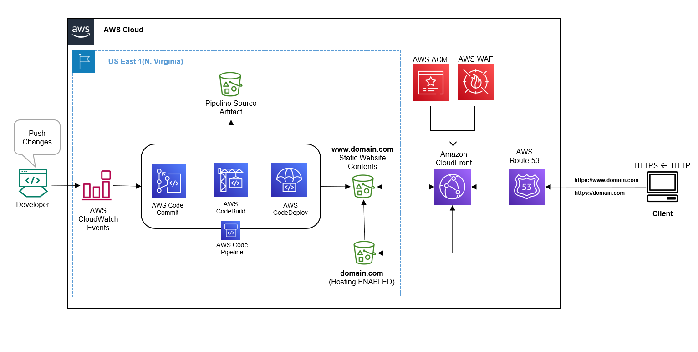

# Advanced Static Website Hosting on AWS S3 - Solution Architecture :cloud:

Welcome to the repository for the advanced static website hosting solution architecture using Amazon S3. This README provides an overview of the solution architecture discussed in the blog post: [Static Website Hosting on AWS S3 - Advanced Level](https://medium.com/aws-in-plain-english/static-website-hosting-on-aws-s3-advanced-level-fa32b534e7f6). Below, you'll find a breakdown of the architecture components, configurations, and resources used to implement the advanced static website hosting solution.

## :art: Solution Architecture

The advanced static website hosting architecture leverages several AWS services to deliver a high-performance, secure, and globally distributed static website. Here's an overview of the key components:

### 1. Amazon S3 Bucket

- The foundation of the architecture is an Amazon S3 bucket configured to host static website content.
- The S3 bucket is set up to enable static website hosting, allowing it to serve HTML, CSS, JavaScript, and other assets.

### 2. Amazon CloudFront

- Amazon CloudFront is integrated with the S3 bucket to provide content delivery and acceleration.
- CloudFront improves website performance by caching content at edge locations worldwide.
- Custom SSL certificates from AWS Certificate Manager (ACM) ensure secure connections.

### 3. Custom Domain Name

- A custom domain name (e.g., www.example.com) is associated with the CloudFront distribution.
- Route 53 is used for DNS management, routing traffic to the appropriate CloudFront distribution.

### 4. HTTPS and Security

- HTTPS is enforced using CloudFront and ACM, ensuring encrypted communication between clients and the website.
- Additional security measures include IAM policies and S3 bucket policies to restrict access.

### 5. Content Delivery and Acceleration

- CloudFront edge locations cache and deliver content to users, reducing latency and improving performance.

## :computer: Getting Started

To implement this advanced static website hosting solution using AWS services, follow for detailed instructions and configurations, refer to the full blog post: [Static Website Hosting on AWS S3 - Advanced Level](https://medium.com/aws-in-plain-english/static-website-hosting-on-aws-s3-advanced-level-fa32b534e7f6).

## :sparkles: Contribution

If you have suggestions, improvements, or additional insights related to this solution architecture, I encourage you to contribute! You can:

- Fork this repository and submit a pull request with your enhancements.
- Open an issue to start a discussion or share your ideas.

Happy website hosting and AWS exploration! :rocket:
